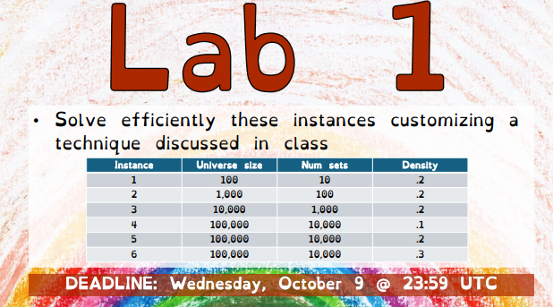

# Set cover problem

This repository contains my work for the Lab 1 of the computational intelligence courses on the [Set cover problem](https://en.wikipedia.org/wiki/Set_cover_problem).



## Notebook

The [set_cover.ipnyb](./set_cover.ipynb) file contains my reflexion about the problem. How I end up step by step with this solution.

For the notebook, the instance is fixed :
```python
UNIVERSE_SIZE = 10_000
NUM_SETS = 1_000
DENSITY = 0.2
iterations = 3_000
```

## Code

The [set_cover.py](./set_cover.py) file contains the final code of my solution to play with it.

### Run
#### Poetry

If you have [Poetry](https://python-poetry.org/) installed on your pc, you can run the file with the following commands :

```shell
cd CI2024_LAB1 # Go to the directory
```

```shell
poetry install # Install dependencies
```

```shell
poetry shell # Start a shell in the virtual environment
```

```shell
python set_cover.py # Run the program
```

#### Others

Otherwise, you can just run the script from scratch since the only dependency (for the python file) are [NumPy](https://numpy.org/doc/2.0/index.html).

```shell
cd CI2024_LAB1 # Go to the directory
```

```shell
pip install numpy # Install NumPy dependency
```

```shell
python set_cover.py # Run the program
```

### Choose instance

You will be finally prompted to first choose your instances, they are the same of the Lab 1 definition.

Then you can choose first the number of iterations and finally the number of trials (see [the code](./set_cover.py) or [the notebook](./set_cover.ipynb) for more information). You can also decide to let the default values (computed by a function) by putting nothing. In that way, you can simply change the constants if it's take to long in your computer.


## Results

Theses results were computed using the default number of iterations and trials.

| Instance  | Universe size | Num sets  | Density   | Time      | Cost                  |
|---------- |---------------|-----------|-----------|-----------|-----------------------|
| 1         | 100           | 10        | .2        | 0m4.605s  | 265.5456989045732     |
| 2         | 1,000         | 100       | .2        | 0m4.434s  | 6,407.724436382979    |
| 3         | 10,000        | 1,000     | .2        | 0m7.053s  | 127,183.7964370989    |
| 4         | 100,000       | 10,000    | .1        | 9m56.090s | 42,400,120.380526625  |
| 5         | 100,000       | 10,000    | .2        | 9m48.346s | 87,754,292.38328813   |
| 6         | 100,000       | 10,000    | .3        | 9m47.708s | 146,410,871.2097435   |